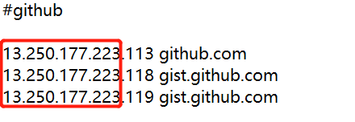
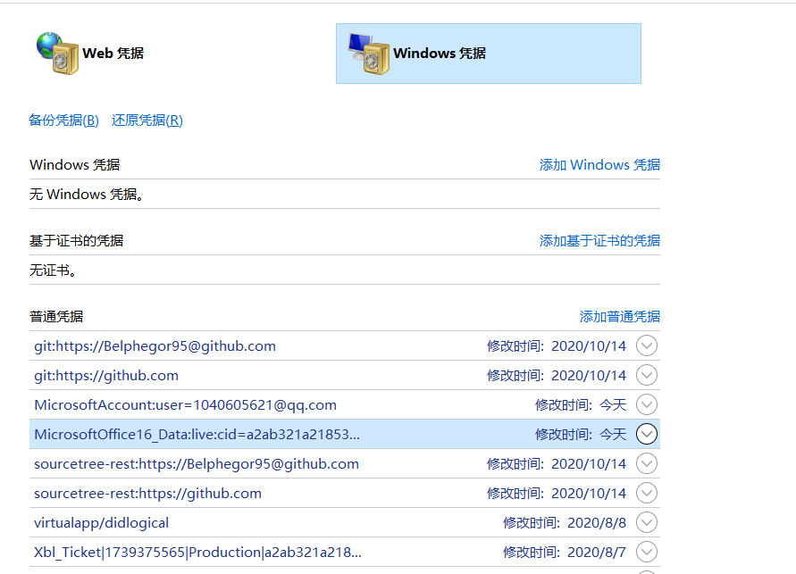

sourcetree拉取项目是一直处于"正在检查源"或者"无效的源路径",git拉取项目提示443错误

<!-- more -->

443错误是访问不到github网站,先网站访问github.com,是否能在不用代理或VPN情况访问

如果不能访问请按照以下操作

1.关闭VPN、代理,重置网络(win10系统,win--设置--网络和lnternet--网络重置)或(控制面板--网络和lnternet--lnternet选项--高级--重置)

2.百度[站长工具](http://seo.chinaz.com/github.com),查询github.com的ip地址

3.用记事本打开C:\Windows\System32\drivers\etc下的hosts,替换IP

之后就能正常访问github,可以直接克隆项目

如果能访问请按照从以下找寻方法

确认Sourcetree的git是否开启(Sourcetree--工具--选项--git)

删除多余凭据(控制面吧--用户帐户--管理我的凭据--window凭据)点击打开删除即可

可能git账号有问题,打开git控制台(git bash here)输入指令,重新登录即可
指令: git config --system --unset credential.helper